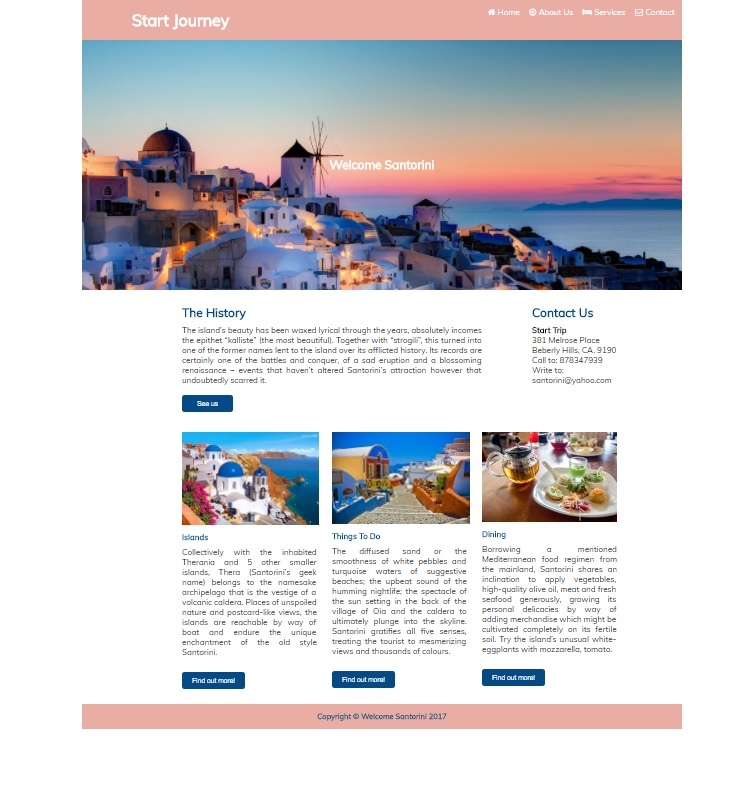

# Proyecto: Mi página - Santorini

## Layout Desktop:

## Dispositivo Móvil:

## Descripción del proyecto: 

El siguiente proyecto es el desarrollo de una página web turística de la Isla de Santorini, mostrando información sobre el lugar y sus atractivos turísticos.

La página está estructurada con HTML y una estructura de grillas de 12 columnas. Los estilos se han aplicado con CSS y para implementar el diseño responsive, se utilizaron las reglas media queries. Además, mediante Javascript se añadió un menú hamburguesa para los dispositivos móbiles.

El diseño gráfico y la elección de la paleta de colores está basado en los paisajes de la isla, para mantener un estilo cálido y agradable.

### Herramientas utilizadas:

1. HTML5

2. CSS3

3. Javascript.